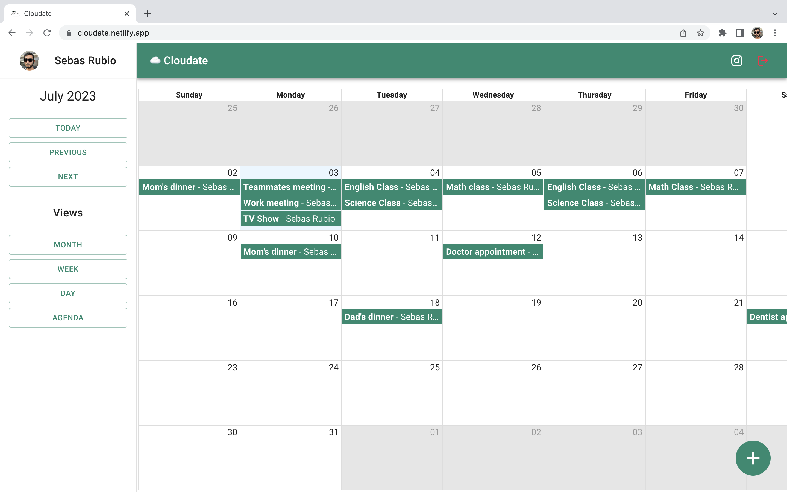

<center></center>

# Cloudate ☁️📆

🔗 [Official Site](https://cloudate.netlify.app/)

📷 [Follow me on Instagram](https://www.instagram.com/4ubio/)

Cloudate let you create and store calendar events in the cloud with notes in them for free. Don't worry about which device are you creating your events, with your account them will be available in any device!

Create your account is easy, you only need your email and password, or if you want, you can register and login with your Google account.

This app has monthly, weekly and daily schedule. Also, an useful agenda for never miss your appointments.

What are you waiting for? Use it now!

<center></center>

<br>

# Devs zone 🧑🏽‍💻

This web app is open source. Whether you want to contribute or just learn, you can use it. Feel free to fork!

## Tech stack and topics

- React.js
- Redux
- MaterialUI
- SPA
- React Router Dom v6
- React Big Calendar
- React Datepicker
- React Modal
- Google Auth
- Firebase
- Axios
- MERN
- Node.js
- Express
- MongoDB
- Mongo Atlas
- Mongoose
- Mongoose models
- JSON Web Tokens
- Custom endpoints
- Express validator
- Bcryptjs

## Run Locally

Clone the project

```bash
  git clone https://github.com/4ubio/Cloudate.git
```

### Frontend

Go to the frontend directory

```bash
  cd Cloudate/frontend
```

Install dependencies

```bash
  yarn
```

Start the server

```bash
  yarn dev
```

```bash
  yarn host
```

### Backend

Go to the backend directory

```bash
  cd Cloudate/backend
```

Install dependencies

```bash
  npm i
```

Start the server

```bash
  npm run dev
```